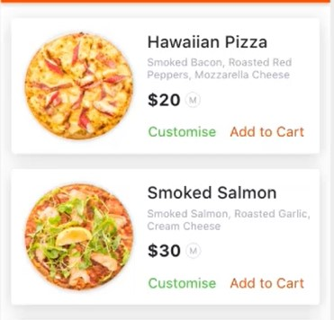

# Fast Guide To Flutter

in this document, I put the details of understanding and creating Flutter Applications.

To make this faster than the original document, I shall create a small snippets of code, which contain the most useful details.

This Document is outlined as follows:

* Design Philosophy - Components and Widgets
* Defining a Widget - Boxes inside boxes
* Adding Behavior - Double Taps to continue.
* Creating Multiple Screen Applications.
* Defining Dependencies - Just Like Composer, sort of.
* Adding a Http Client.

## Design Philosophy

Flutter is trying to be a light-weight Cross-Platform development environment. 

the main competition is React-Native because other platforms -- like Xamarin and Cordova -- is Just too slow to be considered anymore, the cost of performance is high, even when the cost of building in time is slow, the usage of Dart is an interesting choice, but the platform is gathering attention and it does it fast.

When designing for Flutter it's super useful to have an understanding of HTML Structure, 

to explain we can start with Hello World Project:

### Hello Flutter

first just create a new flutter project, and then delete everything in `main.dart` and write this:

```dart
import 'package:flutter/material.dart';

void main() => runApp(Container(
      child: Text(
        'Hello Flutter',
        textDirection: TextDirection.ltr,
      ),
    ));
```

When Running this a simple 'Hello Flutter' Should Appear.

Notice here that the `App` Contain a Single "Widget" as Flutter puts it, a `ViewGroup` as Android Developers calls it. inside we have a `child` which is a `Text` Widget with the 'Hello Flutter' text inside.

### Columns and Rows

Now to have some-kind of `linear layout` here, we can use the `Coulumn` widget as follows.

```dart
import 'package:flutter/material.dart';

void main() =>
    runApp(Column(
      children: <Widget>[
        Text('Hello ', textDirection: TextDirection.ltr),
        Text('Flutter!', textDirection: TextDirection.ltr),
      ],
    ),
);
```


NOTE: WHEN USING ROW, MAKE SURE YOU PUT `Material` AS THE DEAFULT ROOT FOR THE APPLICATION, OTHERWISE IT WILL NOT WORK.


As you can here, we define layouts in Flutter by using what is called a "Widget Tree", in the above example.

here we have master `Column` Contains 2 `Text` Widgets each having a text inside. this idea is super helpful because we can define a Pizza Order page as follows:

### Pizza Order Page Design

If we want to order the Pizza Order Item in the following design



we can design it in flutter using this widget tree:


this translates to the following code

```dart
import 'package:flutter/material.dart';

void main() =>
    runApp(
      MaterialApp(
        title: 'Pizza Application',
        home: Column(
          children: <Widget>[
            Row(
              mainAxisAlignment: MainAxisAlignment.spaceEvenly,
              children: <Widget>[
                Image.asset('assets/images/pizza.jpg', width: 300.0,),
                Column(
                  children: <Widget>[
                    Text('Pizza Name', textDirection: TextDirection.rtl,),
                    Text('Pizza Description', textDirection: TextDirection.rtl,),
                    Text('Pizza Price', textDirection: TextDirection.rtl,),
                    Row(
                      children: <Widget>[
                        Text('Order', textDirection: TextDirection.rtl,),
                        Text('More...', textDirection: TextDirection.rtl,),
                      ],
                    )
                  ],
                )
              ],
            )
          ],
        ),
      )
);
```

We are almost there, this a bare-bones example, if we want to design it a little bit more, it would look like this: you can skip this, but it's Super useful to know how to style some widgets

```dart
import 'package:flutter/material.dart';

void main() => runApp(MaterialApp(
    title: 'Pizza Application',
    home: Material(
      child: Column(
        children: <Widget>[
          Card(
            elevation: 20,
            child: Row(
              mainAxisAlignment: MainAxisAlignment.spaceEvenly,
              children: <Widget>[
                Image.asset(
                  'assets/images/pizza.jpg',
                  width: 300.0,
                  height: 160,
                  fit: BoxFit.fitHeight,
                ),
                Column(
                  mainAxisAlignment: MainAxisAlignment.spaceEvenly,
                  crossAxisAlignment: CrossAxisAlignment.start,
                  children: <Widget>[
                    Text(
                      'Pepperoni Pizza',
                      style: TextStyle(
                          color: Colors.black,
                          fontSize: 24,
                          fontWeight: FontWeight.bold),
                    ),
                    Text(
                      'made from a cured mixture of pork and beef seasoned with paprika or other chili pepper.',
                      maxLines: 3,
                      overflow: TextOverflow.ellipsis,
                      style: TextStyle(color: Colors.grey, fontSize: 12),
                    ),
                    Text(
                      '20\$',
                      style: TextStyle(color: Colors.black, fontSize: 20),
                    ),
                    Row(
                      mainAxisAlignment: MainAxisAlignment.spaceAround,
                      children: <Widget>[
                        Text(
                          'Order',
                          style: TextStyle(color: Colors.black, fontSize: 16),
                        ),
                        Text(
                          'More...',
                          style: TextStyle(color: Colors.black, fontSize: 16),
                        ),
                      ],
                    )
                  ],
                )
              ],
            ),
          )
        ],
      ),
    )));
```

With the final design that looks like:


Ok, that's enough now, let us dig into other things.


## Defining a Widget - Boxes inside boxes

Now that we have semi-good design, we want to replicate this to be reused over and over again, this is where we should separate our classes to make it more readable and reusable.

### Pizza Card Class

there is in Flutter the Concept of "Stateless Widget", in which the widget is drawer once and once only in the life cycle of the screen, since we don't have to change anything it should be ok for now to use it.

take `PizzaCard` widget for example:

```dart
class PizzaCard extends StatelessWidget {
  @override
  Widget build(BuildContext context) {
    return Card(
      elevation: 5,
      child: Row(
        mainAxisAlignment: MainAxisAlignment.spaceEvenly,
        children: <Widget>[
          Image.asset(
            'assets/images/pizza.jpg',
            width: 300.0,
            height: 160,
            fit: BoxFit.fitHeight,
          ),
          Column(
            mainAxisAlignment: MainAxisAlignment.spaceEvenly,
            crossAxisAlignment: CrossAxisAlignment.start,
            children: <Widget>[
              Text(
                'Pepperoni Pizza',
                style: TextStyle(
                    color: Colors.black,
                    fontSize: 24,
                    fontWeight: FontWeight.bold),
              ),
              Text(
                'made from a cured mixture of pork and beef seasoned with paprika or other chili pepper.',
                maxLines: 3,
                overflow: TextOverflow.ellipsis,
                style: TextStyle(color: Colors.grey, fontSize: 12),
              ),
              Text(
                '20\$',
                style: TextStyle(color: Colors.black, fontSize: 20),
              ),
              Row(
                mainAxisAlignment: MainAxisAlignment.spaceAround,
                children: <Widget>[
                  Text(
                    'Order',
                    style: TextStyle(color: Colors.black, fontSize: 16),
                  ),
                  Text(
                    'More...',
                    style: TextStyle(color: Colors.black, fontSize: 16),
                  ),
                ],
              )
            ],
          )
        ],
      ),
    );
  }
}
```

Notice that build function returns a Widget, and since that's the case, we can return the Card we created in the previous example, this is not enough yet, in order to full take advantage of material design we can also add the Scaffold Class

### Scaffold Class

this class is a helper class that takes care of simple designs, it takes care of positioning app bar, adding text to it and positioning the body of the Application, namely our Pizza Card list.

you can use it as follows

```dart
class AppScaffold extends StatelessWidget {
  @override
  Widget build(BuildContext context) {
    return Scaffold(
      appBar: AppBar(
        title: Text("Pizza Application"),
      ),
      body: ListView(
        children: <Widget>[
          PizzaCard(),
          PizzaCard(),
          PizzaCard(),
        ],
      ),
    );
  }
}
```

3 Cards are enough for now :)


### Putting it All together

Now we can add the Scaffold Class to the root of our application to make the layout work.

```dart
void main() => runApp(MaterialApp(
    title: 'Pizza Application',
    home: Material(
      child: AppScaffold()
    )));
```

Full Source Code is available in `widget-list.dart` inside this repo. Note that i used `ListView` to make scrolling work, and to not have a design overflow issues.


## Adding Behavior - Double Taps to continue

Now that we have a functioning list with multiple element in them, how about we start making a toast when pressing a widget.

### Logging for Debugging

the first thing we can do is listen for an event from clicking a widget. to do that we should:

* add an interactive widget like a button
* create a function when the button is pressed
* print a message to the developed that said 'Tapped!'


### Creating a Material Button

we will replace "more..." and "order" Text widget in our `PizzaCard` with a Button, now we have multiple buttons we can choose from the one i chose was `RaisedButton` as follows

```dart
// Above code
// Above code
Row(
  mainAxisAlignment: MainAxisAlignment.spaceAround,
  children: <Widget>[
      Padding(
        padding: const EdgeInsets.only(right: 8),
        child: RaisedButton(
          child: Text(
            'Order',
            style: TextStyle(color: Colors.white),
          ),
          onPressed: null,
        ),
      ),
      Padding(
        padding: const EdgeInsets.all(8.0),
          child: RaisedButton(
            child: Text(
            'More...',
            style: TextStyle(color: Colors.white),
          ),
          onPressed: null, 
        ),
      ),
  ],
)
// Some more code...
```

### Creating a Tap Function

now we return to the root of the `PizzaCard` and we add the following function

```dart
_clicked() {
    print('Clicked!');
  }
```

### Linking the Tap

now we can call this using `onPressed` in the button widget, the final result should look like:

```dart
// Above code
Row(
  mainAxisAlignment: MainAxisAlignment.spaceAround,
  children: <Widget>[
      Padding(
        padding: const EdgeInsets.only(right: 8),
        child: RaisedButton(
          child: Text(
            'Order',
            style: TextStyle(color: Colors.white),
          ),
          onPressed: _clicked, // This is the Main Change from the Last Code
        ),
      ),
      Padding(
        padding: const EdgeInsets.all(8.0),
          child: RaisedButton(
            child: Text(
            'More...',
            style: TextStyle(color: Colors.white),
          ),
          onPressed: _clicked,  // This is the Main Change from the Last Code
        ),
      ),
  ],
)
```


